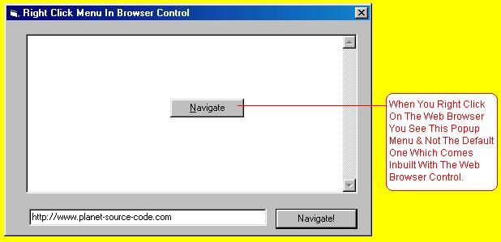



## Custome Right Click Menu Replacer For The Web Browser Control By MM \. \(Sorry 4 Last Time\)

### Description

But Now I HAve Uploaded It On This Server And Have Put A Screen Shot Too So Please See It And Rate Accordingly.

This Replaces The Custome Right Click Menu Of The Web Browser Control By The One Of Your Choice .
 
### More Info
 

             |
---                |---
**Submitted On**   |2002-02-04 23:19:42
**By**             |[Manu Mehrotra](https://github.com/Planet-Source-Code/PSCIndex/blob/master/ByAuthor/manu-mehrotra.md)
**Level**          |Intermediate
**User Rating**    |4.5 (49 globes from 11 users)
**Compatibility**  |VB 3\.0, VB 4\.0 \(16\-bit\), VB 4\.0 \(32\-bit\), VB 5\.0, VB 6\.0, VB Script, ASP \(Active Server Pages\) , VBA MS Access, VBA MS Excel
**Category**       |[Coding Standards](https://github.com/Planet-Source-Code/PSCIndex/blob/master/ByCategory/coding-standards__1-43.md)
**World**          |[Visual Basic](https://github.com/Planet-Source-Code/PSCIndex/blob/master/ByWorld/visual-basic.md)
**Archive File**   |[Custome\_Ri550312132002\.zip](https://github.com/Planet-Source-Code/manu-mehrotra-custome-right-click-menu-replacer-for-the-web-browser-control-by-mm-sorry-4-__1-31759/archive/master.zip)

